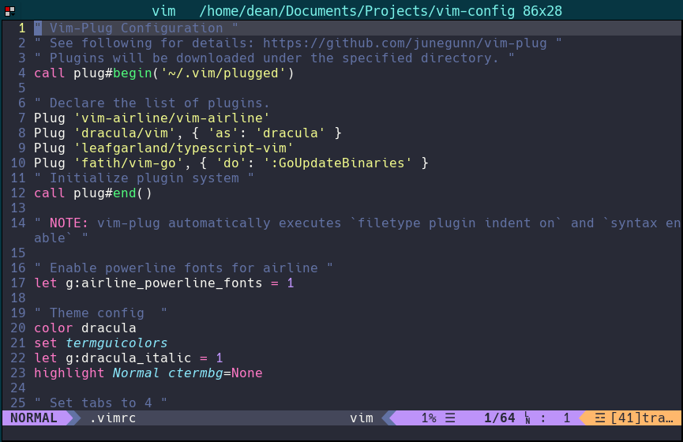

# Introduction
This is my `~/.vimrc`. It's nothing special.

# Screenshot
When set up, it should look something like this:


# Installation
Make sure you have [vim-plug](https://github.com/junegunn/vim-plug) installed:

```bash
curl -fLo ~/.vim/autoload/plug.vim --create-dirs https://raw.githubusercontent.com/junegunn/vim-plug/master/plug.vim
```

Next, back up your existing `~/.vimrc` if you have one and copy my .vimrc to ~/.vimrc:

```bash
curl -o ~/.vimrc https://raw.githubusercontent.com/DeanPDX/vim-config/master/.vimrc
```

Open vim, and run `:PlugInstall`.
